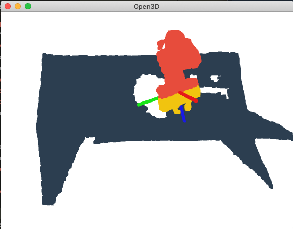

# Learning Markerless Robot-Depth Camera Calibration and End-Effector Pose Estimation

## Install
Please install MinkowskiEngine following the most up-to-date instructions at the [framework's repo](https://github.com/NVIDIA/MinkowskiEngine#Installation). We will continue with the conda environment created here.

Please install Python packages with:
```bash
pip3 install -r requirements.txt
```

## Code
### Training
All model training scripts are located at the root directory. To run training scripts:
```sh
python3 train_*.py --config config/default.yaml
```

We support tensorboard for all our training scripts. You run tensorboard for an experiment to track training progress with:
```sh
tensorboard --port=<port_num> --logdir <exp_path>
```
`exp_path` is defined in config/default.yaml.

All other training parameters can be set in config file under `TRAIN`, `STRUCTURE` and `DATA` keys. For data generation please refer to [Data section](#data).

### Testing individual models
To test the individual models please run:
```sh
python3 test_*.py --config config/default.yaml
```
We also create a copy of config file under each experiment's folder (is set in config file) for easier reproduction. You can also run test scripts with:
```sh
python3 test_*.py --config config/default.yaml --override <exp_path>/<config_file>
```
This overrides the values in the default config with the ones used in that particular experiment.

### Testing the system
To test the overall system you need to set paths to your trained pytorch models (.pth) in config file under INFERENCE key. All the result are exported in to excel file whose path is defined in config file via `TEST.output` key.
```sh
cd app
python3 test.py --config ../config/default.yaml
```

### utils
We use the code here during training, testing and inference. Small part of the code is taken from other code bases whose links are shared in the related comments. We also utilize several frameworks' methods whose information can be found in requirements.txt with the version data.

## Data
Our data files are pickle files (<filename>.pickle) dumped with a single JSON object. JSON object structure is as follows:
```JSON
{
    "points": "<Nx3 numpy.float32 matrix>",
    "rgb": "<Nx3 numpy.float32 matrix>",
    "labels": "<N sized numpy.float32 array> - 0: background, 1: arm, 2: end-effector",
    "instance_labels": "<N sized numpy.float32 array> - 0: background, 1: arm, 2: end-effector",
    "pose": "<7 sized numpy.float32 array>: x, y, z, qx, qy, qz, qw",
    "joint_angles": "<9 sized numpy.float32 array> containing joint angles"
}
```
### Data Visualization
We have shared sample from our test data under `dataset/sample`. You can visualize the data with following commands. Also, you can visualize the segmentation labels using `k` button on your keyboard.
```bash
cd visualization
python3 viz_pickle.py ../dataset/sample/labeled/<filename>.pickle
```

**_Example:_**
```bash
cd visualization
python3 viz_pickle.py ../dataset/sample/labeled/2.pickle
```


